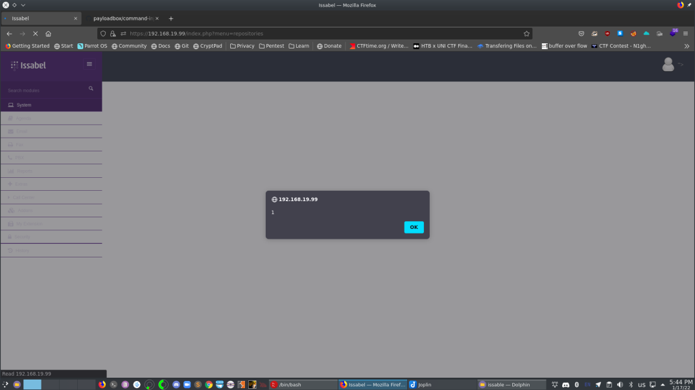

# Issabel-stored-XSS(CVE-2021-46558.)
Issabel PBX 20200102 is vulnerable to stored cross-site-scripting through add new user function

# Reproduce
- first go to add new user and add it as the following '">
- put it in the username and password & description
- now login with the user using the payload
- you will be able to see that our code have been executed

# PoC

